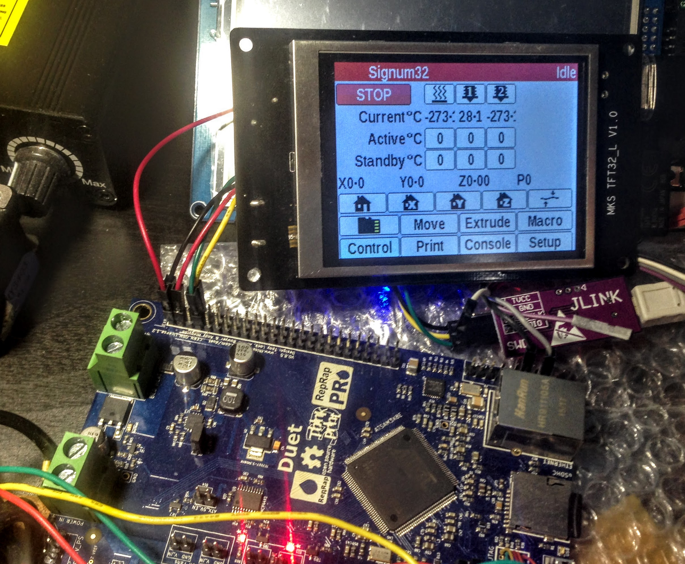

# MKS-TFT
MKS TFT32/28 alternative firmware.

## Current status
Early alpha, most of functions seem to be working. Printing from USB stick and on-screen SD card is not complete.

## Connecting MKS TFT to Duet board

Since Duet has no protection from over-voltage and MKS TFT has 5v UART do not connect MKS TFT directly to the Duet board. Use level shifter (Duet 3.3v <-> MKS TFT 5v):
[Adafruit level shifters](https://www.adafruit.com/category/864)

## Connecting ST-LINK v2 to the MKS TFT: 

    ST-LINK    MKS-TFT32: 
    5v         AUX-1 5v 
    GND        AUX-1 GND 
    SWDIO      JTAG pin 4 
    SWCLK      JTAG pin 5 

## Board JTAG connector (left-to-right):

    3.3v   GND   GND 
    SWDIO  SWCLK RESET

Disconnect MKS TFT from printer before connecting ST-LINK. Do not connect ST-LINK 3.3v pin.
